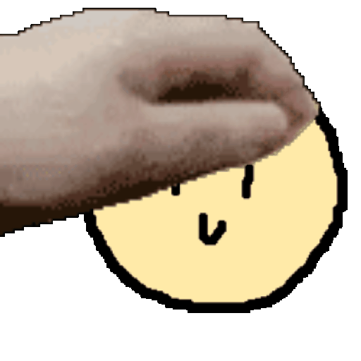

### `petpet-rs`

A fast, parallel Rust library for generating "petpet" GIFs.

<br/>
<br/>
<br/>

## Features

- **Parallel frame generation** using Rayon
- **Customizable resolution** — output GIFs from 16px to any size
- **Circular masking** — clip input images to a circle (Discord avatar style)
- **Quality control** — tune encoding speed vs. output quality (1-30)
- **Zero dependencies at runtime** — all GIF frames are embedded as bytes

## Installation

petpet-rs is not (yet) published to crates.io, so you can add it to your project by adding the following to your `Cargo.toml`:

```toml
[dependencies]
petpet-rs = { git = "https://github.com/CoreBytee/petpet-rs.git" }
```

## Usage

```rust
use image::ImageFormat;
use petpet_rs::PetpetOptions;

fn main() {
    // Load your image
    let img_data = include_bytes!("image.png");
    let img = image::load_from_memory_with_format(img_data, ImageFormat::Png).unwrap();

    // Configure options
    let options = PetpetOptions {
        resolution: 256,   // Output size in pixels (default: 128)
        rounded: true,     // Mask into a circle (default: false)
        quality: 10,       // 1 = best/slowest, 30 = worst/fastest (default: 10)
    };

    // Generate the GIF
    let gif_bytes = petpet_rs::petpet(&img, options);

    // Save to file
    std::fs::write("petpet.gif", gif_bytes).unwrap();
}
```

## Options

| Field        | Type   | Default | Description                                                                           |
| ------------ | ------ | ------- | ------------------------------------------------------------------------------------- |
| `resolution` | `u32`  | `128`   | Width and height of the output GIF in pixels (always 1:1 aspect ratio)                |
| `rounded`    | `bool` | `false` | Whether to mask the input image into a circle                                         |
| `quality`    | `u32`  | `10`    | Encoding quality from 1-30. 1 = best quality (slowest), 30 = fastest (lowest quality) |

## How it works

The petpet effect is created by:

1. Resizing the input image to the target resolution
2. Optionally applying a circular mask
3. Compositing 10 pre-defined hand-drawn petpet frames with the input image
4. The input image subtly scales and repositions across frames to create a "bouncing" illusion
5. Encoding all frames into an animated GIF

Frame generation runs in parallel using Rayon for maximum performance.

## Credits

- https://github.com/SomeAspy/pet-pet-gif
- https://benisland.neocities.org/petpet/

## License

petpet-rs is licensed under the [MIT License](LICENSE).
